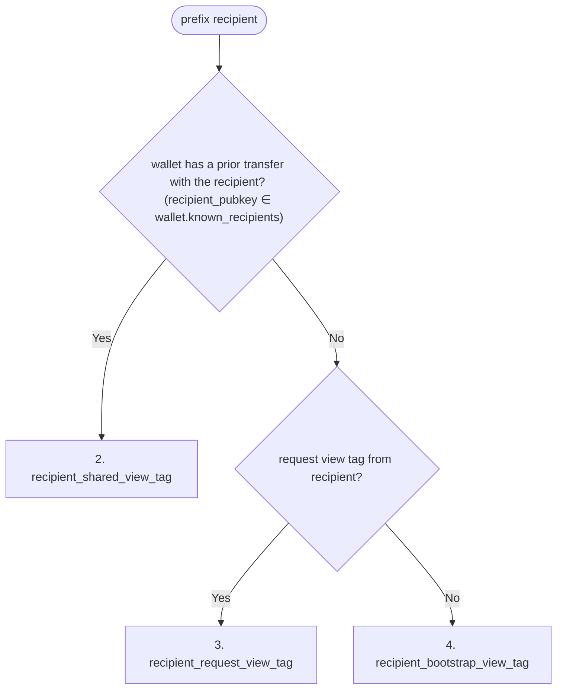

Copied from helius-labs/zolana docs/spec.md at 529c6ce0e31abd1c2821421c67e187f77e3256a6 lines 303-548 (## Owner Hash through end of ## PDA).
Do not include # UTXO (line 550).
Identity math also equal at 51f70d529f9b51a1da6e4f5f43221895d6009adc except owner.owner_proof_input_hash, owner.owner_hash, owner.compressed_address_hash.

## Owner Hash

```
owner_hash := Poseidon(owner_proof_input_hash(signing_pk), nullifier_pk)
```

SPP derives the Solana owner proof input from the verified signer account — an
Ed25519 signer or a PDA signing via `invoke_signed`. The circuit relies on the
SVM's signature verification, so the two are equivalent in the proof. The
`RingP256` rail instead proves one shared P256 signature and derives the owner
proof input from the point's x-coordinate in-circuit.

# Shielded Keypair

The client-side triple behind a [Shielded Address](#shielded-address): a
[Signing Key](#signing-key), a [Nullifier Key](#nullifier-key), and a
[ViewingKey](#viewingkey).

**Curves** (the `PublicKey` scheme prefix, [Glossary](#glossary)):

- `Ed25519` — Solana signer, authorized by SPP's signer-account check.
- `P256` — `RingP256` rail, one shared P256 signature proven in-circuit.
- `Pda` — off the Ed25519 curve and cannot sign; the owning program authorizes via `invoke_signed`.

**Interface**:

- `signing_pubkey` — the [Signing Key](#signing-key) public key (`PublicKey`).
- `viewing_pubkey` — [ViewingKey](#viewingkey) public key (`P256Pubkey`).
- `curve` — the signing scheme identifier: the `PublicKey` scheme prefix ([Glossary](#glossary)).
- `sign_message(msg)` — message signature in the scheme's native form ([Signing Key](#signing-key) methods).
- `sign_hash(hash)` — signature over a caller-supplied digest, for the proof path ([Signing Key](#signing-key) methods).
- `nullifier_key` — the host-side [Nullifier Key](#nullifier-key), used to build spendable inputs.
- `nullifier(utxo)` — the UTXO's [nullifier](#nullifier).
- `nullifier_pk` — the published half of the nullifier role ([Nullifier Key](#nullifier-key)).
- `owner_hash` — the [Owner Hash](#owner-hash) of the signing and nullifier public keys.
- `shielded_address` — the three public keys as a [Shielded Address](#shielded-address).
- `compressed_address` — its compressed form: `owner_hash` and `viewing_pubkey`.

## Signing Key

`(signing_sk, signing_pk)` — the spend-authorizing keypair.

**Methods:**

- `pubkey() -> PublicKey` — the scheme-tagged public key ([Glossary](#glossary)).
- `sign_message(msg) -> Result<Signature>` — the scheme's native message signature: Ed25519 over the raw bytes (RFC 8032, delegated to the host Solana wallet), P256 as ECDSA over `SHA-256(msg)` normalized to low-S, matching Solana's secp256r1 precompile. PDA: error.
- `sign_hash(hash: [u8; 32]) -> Result<Signature>` — P256 ECDSA over a caller-supplied digest; the proof verifies it against `SHA-256(private_tx_hash)`. Ed25519 owners sign digest bytes with `sign_message`; PDA: error.

## Nullifier Key

Symmetric 31-byte key to derive nullifiers. The `nullifier_secret` is
wallet-side material: it is a private proof input on every spend path, so it
cannot be hardware-resident. It is required to spend but does not authorize a
spend: authorization is the owner signature, checked by the proof
(`RingP256`) or by SPP's signer-account check (Ed25519, PDA).

`nullifier_pk := Poseidon(nullifier_secret)`

**Methods:**

- `nullifier_pk() -> [u8; 32]` — returns `nullifier_pk` (defined above).
- `nullifier(utxo) -> [u8; 32]` — the UTXO's [nullifier](#nullifier).

## ViewingKey

`(viewing_sk, viewing_pk)` — P-256 keypair, used for HPKE encryption and to
derive view-tag secrets. Viewing keys can rotate. Each scenario defines how
`viewing_sk` is produced.

### Derived secrets

Secrets derive from `view_root`, an ECDH-derived root, so the viewing key can stay in an HSM (one `CKM_ECDH1_DERIVE`).

- `P_const   := hash_to_curve_P256(DST="TSPP/view_root/P_const/v1")` — RFC 9380 `P256_XMD:SHA-256_SSWU_RO_`; fixed generator, unknown discrete log relative to `G` (else `ECDH(viewing_sk, P_const) = p·viewing_pk` would be public).
- `view_root := HKDF-Extract(salt=∅, IKM=ECDH(viewing_sk, P_const))` — `ECDH` is the shared point's 32-byte big-endian x-coordinate.
- `sender_view_tag_secret    := HKDF-Expand(view_root, "TSPP/sender_view_tag",    L=32)`
- `recipient_view_tag_secret := HKDF-Expand(view_root, "TSPP/recipient_view_tag", L=32)`
- `tx_viewing_secret         := HKDF-Expand(view_root, "TSPP/tx_viewing",         L=32)` — seeds the transaction viewing keys.

### Transaction Viewing Key

The transaction viewing key is a single use keypair (ephemeral key) that is deterministically derived for every private transaction.
Every ciphertext in a transaction is encrypted with HPKE between the transaction viewing key and the ciphertext owner's viewing key.
This way the transaction viewing key can decrypt both the sender's change and recipient UTXOs of the transaction.

**Properties**

- **Scope**: one transaction.
- **Read-only**: viewing keys grant decryption only.
- **Derivable on demand**:
  ```
  first_nullifier := nullifier_key.nullifier(inputs[0])              // see [Nullifier](#nullifier)
  (tx_viewing_sk, tx_viewing_pk) := HKDF-SHA256(salt=first_nullifier, IKM=tx_viewing_secret, info="TSPP/tx_viewing")
  ```
  `tx_viewing_secret` is defined in [Derived secrets](#derived-secrets). Binding the HKDF salt to `first_nullifier` makes the keypair unique per Solana transaction (nullifier tree uniqueness implies `tx_viewing_pk` uniqueness).

### View Tags

The view-tag types in this section (`sender_view_tag`, `recipient_shared_view_tag`, `recipient_request_view_tag`, `recipient_bootstrap_view_tag`) apply to **anonymous policy rings only**. In the confidential [default ring](#default-ring) every output — sender change, recipients, and the [`merge_transact`](#merge_transact) output — is tagged by its Ed25519 owner pubkey, so a wallet syncs by querying the indexer for its own owner pubkey.

Policy rings hide the recipient, so a wallet cannot find its outputs by owner pubkey as in the [default ring](#default-ring). Instead a view tag, a 32-byte value attached to a ciphertext, lets wallets sync by querying the indexer for exact view-tag matches and decrypt only their own transactions. Derivation splits into two cases — tags the sender derives for themselves to discover their own change UTXOs, and tags the sender derives for the recipient to discover incoming transfers.

A recipients wallet cannot pre-derive shared tags for every possible sender. Therefore the wallet needs to know which senders to derive view tags for. The first transfer between a new sender-recipient pair uses a tag the recipient can find without prior knowledge of the sender: either `recipient_request_view_tag` (recipient minted, shared out-of-band) or `recipient_bootstrap_view_tag = recipient.viewing_pk` (no coordination required). This first transfer establishes the pair: on decryption the recipient reads `sender_pubkey` from the ciphertext and derives the shared ECDH key, and subsequent transfers from this sender use a shared tag (`recipient_shared_view_tag`) to find transaction. `sender → recipient` and `recipient → sender` produce disjoint tags.

**Uniqueness.** View tags should not be reused. The indexer must handle the case that these may be used multiple times erroneously and return all ciphertexts matching a single tag value.

**Encoding.**  all view tags are constant length 32 bytes. Shorter view tags are prefixed with 0s.

#### Sender View Tag

1. **`sender_view_tag`**
  - Derived by: the sender, to index her change utxos.
  - Tx sent by: the sender
  - Indexed by: the sender
  - Derivation: `HKDF-SHA256(salt=∅, IKM=sender_view_tag_secret, info="TSPP/sender_view_tag/" || u64_be(tx_count), L=31)`.

#### Recipient view tag

2. **`recipient_shared_view_tag`**
    - Derived by: the sender and recipient independently. Sender via `get_send_shared_view_tag` to send the tx, the recipient via `get_recipient_shared_view_tag` to index the tx.
    - Tx sent by: the sender.
    - Indexed by: the recipient.
    - Derivation: two chained HKDFs over the ECDH shared secret.

      ```
      shared := ECDH(self.viewing_sk, counterparty_pubkey)
      domain := HKDF-SHA256(salt = ∅, IKM = shared,
                           info = "TSPP/pair-domain/" || R_pubkey, L = 32)
      return    HKDF-SHA256(salt = ∅, IKM = domain,
                           info = "TSPP/pair-hint/"   || u64_be(i), L = 31)
      ```

      `R_pubkey` is the recipient of the direction: `counterparty_pubkey` on the sender side (`get_send_shared_view_tag`), `self.viewing_pk` on the recipient side (`get_recipient_shared_view_tag`). ECDH symmetry plus the matched direction label produces the same byte value across the pair.
3. **`recipient_request_view_tag`**
    - Derived by: the recipient. The recipient shares the tag with the sender out-of-band as a `PaymentRequest`.
    - Tx sent by: the sender.
    - Indexed by: the recipient. Once the recipient decrypts this transfer, subsequent transfers from the same sender can be indexed by `recipient_shared_view_tag`.
    - Derivation: `HKDF-SHA256(salt=∅, IKM=recipient_view_tag_secret, info="TSPP/recipient_request_view_tag/" || u64_be(request_count), L=31)`.
4. **`recipient_bootstrap_view_tag`**
    - Derived by: anyone — `recipient.viewing_pk` 32-byte X-coordinate of the SEC1-compressed encoding (the 33-byte form with its 1-byte sign prefix dropped).
    - Tx sent by: the sender.
    - Indexed by: the recipient. Once the recipient decrypts this transfer, subsequent transfers from the same sender can be indexed by `recipient_shared_view_tag`.
    - [Plaintext Transfer](#plaintext-transfer): sender bundles and recipient slots are indexed by the 32-byte owner tag in place of `viewing_pk`. The slot contains no `sender_pubkey`, so `known_senders` / `known_recipients` are not updated and the next encrypted transfer between the pair is again a first transfer.


#### Merge output indexing (removed merge view tag)

The single-use `merge_view_tag` stream — `merge_view_tag_secret`, a per-user `merge_count`, the HKDF tag derivation, and SPP's nullifier-tree insertion of the tag — was removed. `merge_transact` tags the merged output with the owner signing pubkey like every confidential default-ring output; [`merge_ring`](#merge_ring) indexes the output by the **first input's published nullifier**; neither instruction takes a supplied tag. The output blinding and the padding-slot nullifiers are derived deterministically from the owner's nullifier secret and that first nullifier (`merge_output_blinding` / `merge_dummy_nullifier`, domain-separated Poseidon — see [Methods](#methods)), and replay protection comes from the proof-bound input nullifiers themselves.

#### View Tag Selection

In the [default ring](#default-ring) every output is tagged by its recipient owner pubkey, so the selection below applies only to anonymous policy rings. `merge_transact` outputs are tagged by the owner signing pubkey like every other default-ring output; `merge_ring` outputs are indexed by the first input's published nullifier, not by a view tag. Wallets select recipient tags as follows:



### Methods

1. `decrypt(ciphertext, tx_viewing_pk) -> Result<Plaintext>` — AES-CTR decryption with key `KDF(ECDH(viewing_sk, tx_viewing_pk))`.
2. `get_sender_view_tag(tx_count)` — policy-ring anonymous transfers only; tags the sender's own change UTXOs. The default ring tags change by the sender's owner pubkey.
3. `get_recipient_request_view_tag(request_count)` — used by the recipient to create a view tag for a `PaymentRequest` shared with the sender out-of-band.
4. `get_send_shared_view_tag(counterparty_pubkey, i)` — sender-side `recipient_shared_view_tag`; used for transfers to a recipient the sender has already paired with.
5. `get_recipient_shared_view_tag(counterparty_pubkey, i)` — recipient-side `recipient_shared_view_tag`; used during sync to scan transfers from each known sender.
6. `merge_output_blinding(first_nullifier)` / `merge_dummy_nullifier(first_nullifier, slot_index)` — deterministic merge derivations from the owner's nullifier secret (domain-separated Poseidon); used by the merge prover when building [`merge_transact`](#merge_transact) / [`merge_ring`](#merge_ring) and by the owner during sync to reconstruct merged outputs. Replaces the removed `get_merge_view_tag(merge_count)`.
7. `get_transaction_viewing_key(first_nullifier: [u8; 32]) -> P256Keypair` — per-transaction P-256 keypair for ECDH encryption to recipients.

## Derivation seed

The root secret both role keys expand from in the local-key scenarios
([Solana wallet](#solana-wallet), [Local P-256](#local-p-256)). Obtaining it
consumes only a signing operation (`ECDH` or a deterministic signature).

Role expansion, shared by both scenarios:

- `prk := HKDF-Extract(salt=∅, IKM=derivation_seed)`
- `nullifier_secret := HKDF-Expand(prk, nf_info, L=31)`
- `viewing_sk := HKDF-Expand(prk, view_info, L=48)` reduced to a P-256 scalar (RFC 9380 hash-to-field)

The two scenarios define `derivation_seed`, `nf_info`, and `view_info`.

**Derivation-input guard.** Signing rejects any message whose payload (bare or
off-chain encoded) starts with `"TSPP/derive/"`; generic ECDH rejects the
committed derivation points (`P_derive`, `P_pda` — see [PDA](#pda)).

## Solana wallet

Sign: the wallet's Ed25519 key, checked by SPP as the signer account.

- `derivation_seed := Ed25519_sign(signing_sk, derivation_message)` — deterministic (RFC 8032), so any wallet that signs off-chain messages reconstructs the keypair and the Ed25519 secret never leaves the wallet. The 64-byte seed is itself secret material: whoever holds it derives both role keys.
- `derivation_message` — the Solana off-chain message v0 encoding of the payload `"TSPP/derive/v1"`: `"\xffsolana offchain" || version=0 || application_domain || format=0 || signer_count=1 || signing_pk || u16_le(payload_len) || payload`, with `application_domain := SHA-256("TSPP/derive/v1")`.
- `nf_info = "TSPP/nf_key/ed25519/v1"`, `view_info = "TSPP/view_key/ed25519/v1"`.

## P-256 wallet

Sign: ECDSA with a locally held key (`RingP256` rail).

- `derivation_seed := ECDH(signing_sk, P_derive)` — the shared point's 32-byte big-endian x-coordinate (one `CKM_ECDH1_DERIVE`).
- `P_derive := hash_to_curve_P256(DST="TSPP/nullifier/P_nullifier/v1")` — same RFC 9380 construction as [`P_const`](#derived-secrets), distinct point; unknown discrete log, so only the signing-key holder can compute the shared x-coordinate.
- `nf_info = "TSPP/nf_key/ecdh/v1"`, `view_info = "TSPP/view_key/ecdh/v1"`.

## HSM

Sign: on the device. Device signing keys cannot run key agreement, so the
[derivation seed](#derivation-seed) is unavailable: the nullifier and viewing
roles root in separate device keys (three-key custody) and are supplied at
construction. The `nullifier_secret` stays host-side
([Nullifier Key](#nullifier-key)).

## Seed phrase

All three parts derive from one BIP-39 mnemonic: the signing key on Solana's
derivation path, the role keys on TSPP paths. Every path segment is hardened;
`node(path)` is the 32-byte SLIP-0010 Ed25519 node key at `path` (HMAC-SHA512
tree over the seed), `node_p256(path)` the 32-byte SLIP-0010 nist256p1 node
key (master key from HMAC-SHA512 with key `"Nist256p1 seed"`; invalid
candidates are handled inside SLIP-0010's derivation). `TSPP_COIN =
1392955331` (`be_u32(SHA-256("luminous.TSPP.v1")[0..4]) & 0x7FFF_FFFF`).

- `seed := BIP-39(mnemonic, passphrase)` — PBKDF2-HMAC-SHA512, 64 bytes; `passphrase = ""` unless the wallet sets one.
- `signing_sk := node(m/44'/501'/account'/0')` — Ed25519 secret on Solana's path: importing the mnemonic into a Solana wallet yields the same key.
- `p256_signing_sk := node_p256(m/44'/TSPP_COIN'/account'/0'/0')` — a valid P-256 scalar by construction.
- `nullifier_secret := node(m/44'/TSPP_COIN'/account'/1'/0')[1..32]` — the node key with its first byte dropped (31 bytes).
- `viewing_sk := node_p256(m/44'/TSPP_COIN'/account'/2'/0')` — a valid P-256 scalar by construction.
- Both identities use the same `nullifier_secret` and `viewing_sk`. Wherever both publish the shared `viewing_pk` — registry records, bootstrap view tags, shielded addresses — the two owners are linkable.
- `account'` — each account index is an independent shielded keypair.

Shares the signing key with the [Solana wallet](#solana-wallet) scenario but
not the role keys; the two keypairs coexist, and a seed-phrase wallet also
derives the Solana-wallet keypair to sync both.

## PDA

No signing key: the owning program authorizes with `invoke_signed`. Both role
keys expand from one viewing-key ECDH shared secret, with the PDA address in
each info tag so a holder does not reuse one identity across PDAs.

- `shared := ECDH(holder_viewing_sk, counterparty_viewing_pk)` — either participant derives the identity from its own viewing key and the counterparty's viewing pubkey. A sole holder uses `ECDH(holder_viewing_sk, P_pda)` with `P_pda := hash_to_curve_P256(DST="TSPP/pda_root/P_pda/v1")`.
- `prk := HKDF-Extract(salt=∅, IKM=shared)`
- `nullifier_secret := HKDF-Expand(prk, "TSPP/pda_nf/v1" || pda, L=31)`
- `viewing_sk := HKDF-Expand(prk, "TSPP/pda_view/v1" || pda, L=48)` reduced to a P-256 scalar (RFC 9380 hash-to-field)
